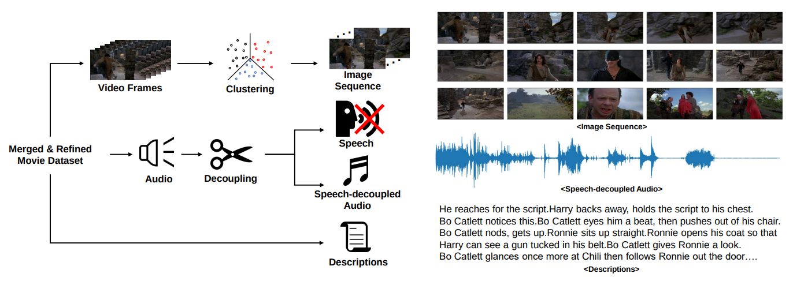

# [Findings of EMNLP 2023] Sound of Story: Multi-modal Storytelling with Audio", Findings of EMNLP 20223

This repository is official for "[Sound of Story: Multi-modal Storytelling with Audio](https://arxiv.org/abs/2310.19264)", Findings of EMNLP 2023.

## Abstract

Storytelling is multi-modal in the real world. When one tells a story, one may use all of the visualizations and sounds along with the story itself. However, prior studies on storytelling datasets and tasks have paid little attention to sound even though sound also conveys meaningful semantics of the story. Therefore, we propose to extend story understanding and telling areas by establishing a new component called "background sound" which is story context-based audio without any linguistic information. For this purpose, we introduce a new dataset, called "Sound of Story (SoS)", which has paired image and text sequences with corresponding sound or background music for a story. To the best of our knowledge, this is the largest well-curated dataset for storytelling with sound. Our SoS dataset consists of 27,354 stories with 19.6 images per story and 984 hours of speech-decoupled audio such as background music and other sounds. As benchmark tasks for storytelling with sound and the dataset, we propose retrieval tasks between modalities, and audio generation tasks from image-text sequences, introducing strong baselines for them. We believe the proposed dataset and tasks may shed light on the multi-modal understanding of storytelling in terms of sound. 


## Overall



## Todo Lists
- [X] Data Downloading
- [X] Data Processing
- [ ] Retrieval Baselines
- [ ] Audio Generation Baselines


## 1. Download Movie datasets

### Download Condensed Movie Dataset

> https://www.robots.ox.ac.uk/~vgg/data/condensed-movies/

### Download LSMDC Dataset

> https://sites.google.com/site/describingmovies


## 2. Data post-processing

0. Before start, you shoud download the description of CondensedMovies from the link below:

> https://github.com/m-bain/CondensedMovies/tree/master/data/metadata


1. After download all the datsets, run the processing codes as follow

```
sh video_processing.sh
```

※ Note that you **MUST** change the path for each data dataset in shell script code

2. After all movies are generated & processed, Run the post processing code as follow

```
sh data_processing.sh
```

## 3. Retrieval


## 4. Audio Generation


## Citation

@inproceedings{jaeyeon2023sound,
  title={Sound of Story: Multi-modal Storytelling with Audio},
  author={Jaeyeon, BAE and Jeong, Seokhoon and Kang, Seokun and Han, Namgi and Lee, Jae-Yon and Kim, Hyounghun and Kim, Taehwan},
  booktitle={The 2023 Conference on Empirical Methods in Natural Language Processing}
}